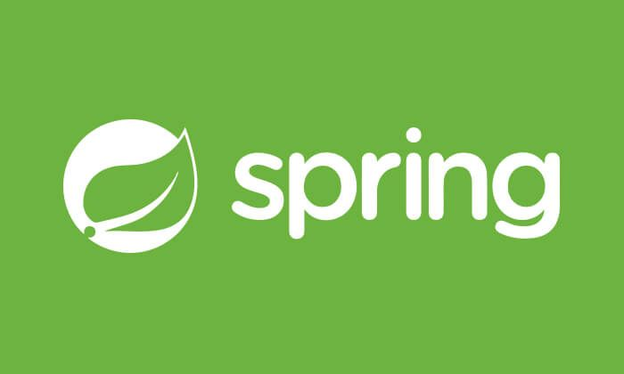

<b>
👋 Hi, I’m Kavana D M</b>

 

# ✈️ About Me
> I'm a passionate Data Analyst with a knowledge in SQL, Advanced Excel, Statistical Analysis, and Automation.  .
* 🔭 I'm currently enhancing my skills in Advanced Python
+ 💬 Ask me about SQL, DBMS, Advanced Excel and Statistical Analysis.
- 📫 How to reach me: kavanadm05@gmail.com

# Skills
- SQL
- Excel
- Power BI
- Statistics 
- DBMS
- Git

# 📊 GiHub Stats

# 🔗 Connect with me

# Languages and Tools

